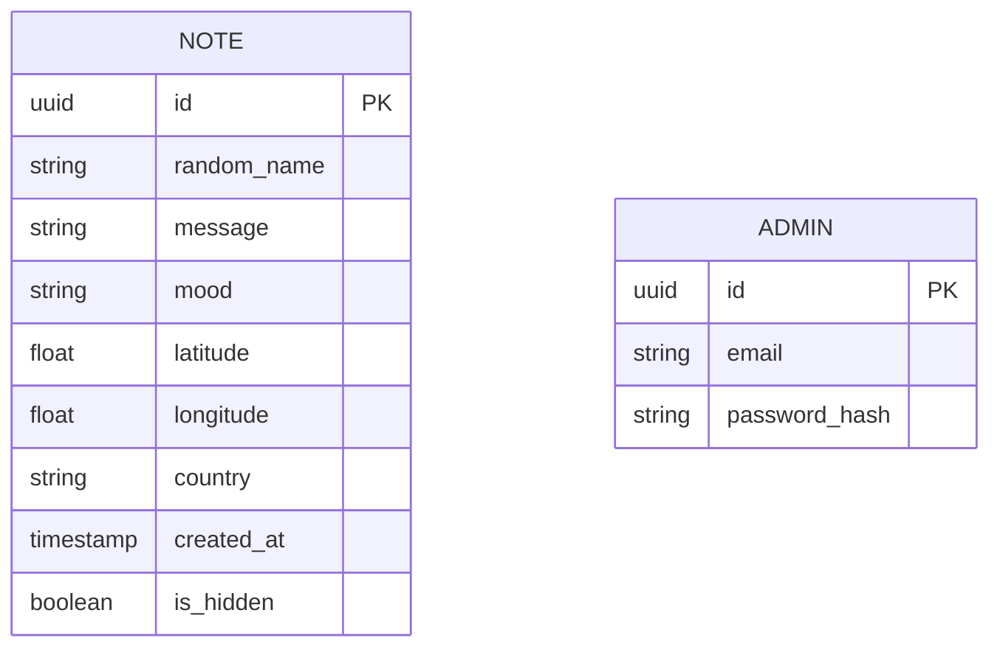
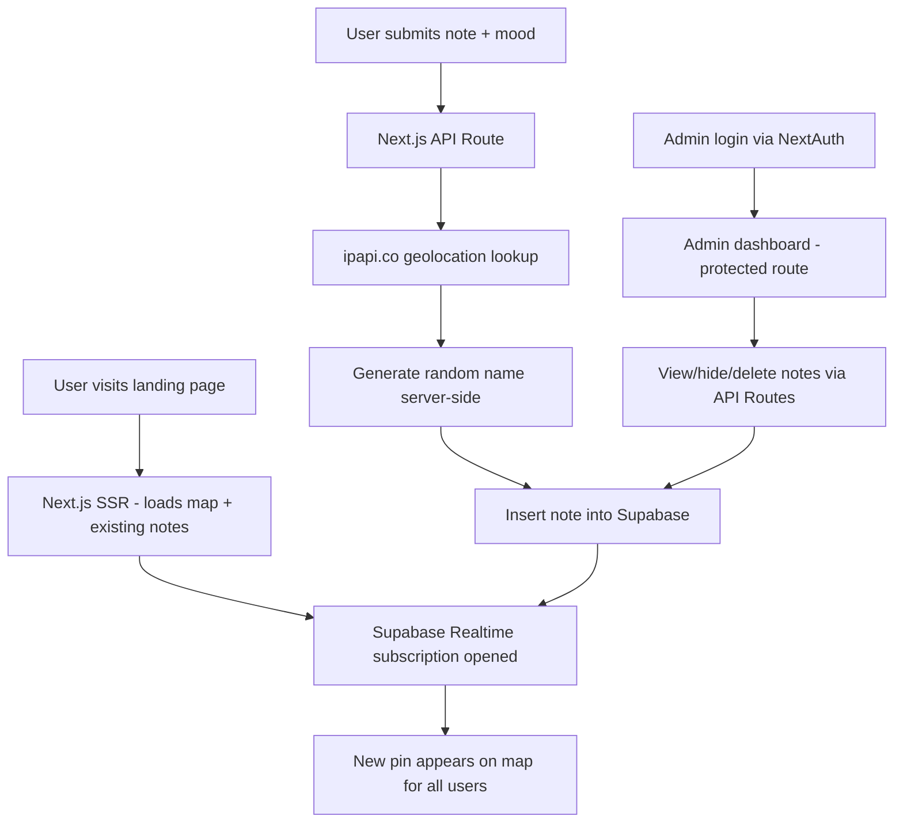

# System Plan — Morrow

**Project:** Anonymous world map where users drop mood-tagged notes, pinned via IP geolocation. Admin-only management panel.  
**Type:** Portfolio + public launch  
**Scale:** Solo developer, MVP  
**Deployment:** Vercel + Supabase

---

## Phase 1 — Tech Stack

| Layer       | Choice                | Why                                    |
| ----------- | --------------------- | -------------------------------------- |
| Frontend    | Next.js + TypeScript  | Vercel-native, SSR, portfolio-worthy   |
| Map         | react-leaflet         | Free, no API key, flexible             |
| Styling     | Tailwind CSS          | Fast MVP                               |
| State       | Zustand               | Lightweight, no boilerplate            |
| Backend     | Next.js API Routes    | One repo, Vercel serverless            |
| Database    | Supabase (PostgreSQL) | Free tier, realtime built-in, familiar |
| Auth        | NextAuth.js           | Admin-only, simple credentials         |
| Geolocation | ipapi.co              | Free, server-side, no key needed       |

### Key Trade-offs

- API Routes are serverless — no persistent connections. Supabase Realtime handles live map updates.
- Leaflet vs Mapbox: Leaflet is free and flexible. Mapbox is prettier but has billing at scale. Leaflet is correct for MVP.
- Supabase free tier has no automated backups. Acceptable risk at MVP stage.

---

## Phase 2 — System Architecture

### Module Breakdown

| Module          | Responsibility                                               |
| --------------- | ------------------------------------------------------------ |
| Map View        | Renders world map, fetches and displays all notes as pins    |
| Note Submission | Form for mood + message, triggers geolocation, saves to DB   |
| Realtime Layer  | Supabase Realtime — pushes new pins to all connected clients |
| Admin Panel     | Protected route: view all notes, hide/delete, mood breakdown |
| Auth            | NextAuth session for admin only                              |

### ERD



No user accounts. Notes are standalone records. `random_name` generated server-side. `is_hidden` is a soft delete.

### Architecture Flow



---

## Phase 3 — Project Structure

```
morrow/
├── app/
│   ├── page.tsx                  # Landing page with map
│   ├── admin-management/
│   │   ├── page.tsx              # Admin dashboard
│   │   └── layout.tsx            # Auth guard for admin routes
│   └── api/
│       ├── notes/
│       │   ├── route.ts          # GET all notes, POST new note
│       │   └── [id]/route.ts     # PATCH (hide), DELETE
│       └── auth/
│           └── [...nextauth]/route.ts
├── components/
│   ├── Map/
│   │   ├── WorldMap.tsx          # Main map component
│   │   ├── NotePin.tsx           # Individual pin with popup
│   │   └── NoteForm.tsx          # Submission form/modal
│   ├── Admin/
│   │   ├── NoteTable.tsx
│   │   └── MoodStats.tsx
│   └── ui/                       # Generic reusable components
├── lib/
│   ├── supabase.ts               # Supabase client
│   ├── nameGenerator.ts          # Random name logic
│   └── geolocation.ts            # ipapi.co wrapper
├── stores/
│   └── notesStore.ts             # Zustand store
├── types/
│   └── index.ts                  # Note, Mood, Admin types
└── middleware.ts                  # Protects /admin-management routes
```

**Conventions:**

- Components in PascalCase, filename matches component name
- API routes are thin — logic lives in `lib/`
- `middleware.ts` at root handles admin route protection via NextAuth session check

---

## Phase 4 — Security & Auth

### Authentication Strategy

- NextAuth.js credentials provider, single admin user
- Credentials stored in `.env.local` / Vercel env vars — never in DB, never committed
- Session stored as httpOnly cookie (NextAuth default) ✅
- Admin route protection via Next.js `middleware.ts`

### Authorization

- No roles at MVP — admin or anonymous public
- All note mutation endpoints check for valid NextAuth session server-side
- Public endpoints (GET notes, POST note) are unauthenticated by design

### Security Checklist

- [ ] Input validation on note submission — max length, sanitize message
- [ ] Rate limiting on `POST /api/notes` — use Upstash Ratelimit to prevent spam
- [ ] Geolocation call is server-side only — client never touches ipapi.co
- [ ] Admin credentials in env vars only, never hardcoded
- [ ] `is_hidden` notes excluded from public GET query — never sent to frontend
- [ ] HTTPS enforced by Vercel by default ✅
- [ ] Error responses never expose stack traces or DB details to client
- [ ] Supabase RLS: public can only INSERT + SELECT non-hidden notes; service role key used server-side only
- [ ] Supabase service role key never exposed to frontend — anon key only client-side

---

## Phase 5 — CI/CD Pipeline

### Platform: GitHub Actions + Vercel

### Branch Strategy

| Branch | Purpose                                     |
| ------ | ------------------------------------------- |
| `main` | Production — auto-deploys to Vercel         |
| `dev`  | Working branch — Vercel preview deployments |

### GitHub Actions Workflow

```yaml
# .github/workflows/ci.yml
name: CI

on:
  push:
    branches: [main, dev]
  pull_request:
    branches: [main]

jobs:
  ci:
    runs-on: ubuntu-latest
    steps:
      - uses: actions/checkout@v4

      - uses: actions/setup-node@v4
        with:
          node-version: 20
          cache: "npm"

      - name: Install dependencies
        run: npm ci

      - name: Type check
        run: npx tsc --noEmit

      - name: Lint
        run: npm run lint

      - name: Audit dependencies
        run: npm audit --audit-level=high

      - name: Build
        run: npm run build
        env:
          NEXTAUTH_SECRET: ${{ secrets.NEXTAUTH_SECRET }}
          NEXT_PUBLIC_SUPABASE_URL: ${{ secrets.NEXT_PUBLIC_SUPABASE_URL }}
          NEXT_PUBLIC_SUPABASE_ANON_KEY: ${{ secrets.NEXT_PUBLIC_SUPABASE_ANON_KEY }}
```

### Environments

| Environment | Branch      | Supabase Project                   |
| ----------- | ----------- | ---------------------------------- |
| Production  | `main`      | `world-notes-prod`                 |
| Preview     | `dev` / PRs | `world-notes-dev`                  |
| Local       | —           | `world-notes-dev` via `.env.local` |

> ⚠️ Never point local development at the production Supabase project.

---

## Phase 6 — DevOps Setup

### Vercel

- Connect GitHub repo, auto-deploy on push to `main`
- All env vars set in Vercel dashboard — not in code
- Enable Vercel Analytics (free) — useful for portfolio showcase

### Supabase

- Two projects: `morrow-dev` and `morrow-prod`
- Enable Row Level Security on `notes` table from day one
- Migrations via Supabase CLI, committed under `supabase/migrations/`
- Free tier has no automated backups — acceptable at MVP, revisit on launch

### Rate Limiting

Add **Upstash Redis** (free tier) with `@upstash/ratelimit` on `POST /api/notes`.  
Without this, the map is trivially spammable. Do this before launch.

### Monitoring

- **Sentry** (free tier) — catches runtime errors in frontend and API routes, 15-min setup
- **Vercel dashboard** — function logs, error rates, response times built in

### Domain & SSL

- Free `.vercel.app` subdomain is fine for portfolio
- Custom domain: add in Vercel dashboard, SSL via Let's Encrypt managed automatically ✅

---

## Pre-Coding Checklist

Before writing any application code:

- [ ] Create two Supabase projects (dev + prod)
- [ ] Initialize Next.js project with TypeScript + Tailwind
- [ ] Set up `.env.local` with dev credentials
- [ ] Write initial Supabase migration for `notes` table with RLS policies
- [ ] Connect GitHub repo to Vercel
- [ ] Set up GitHub Actions CI workflow
- [ ] Add all env vars to Vercel dashboard
- [ ] Set up Sentry project
- [ ] Set up Upstash Redis project for rate limiting
- [ ] Create `dev` branch — never commit directly to `main`

---

_Generated by fullstack-project-planner skill_
